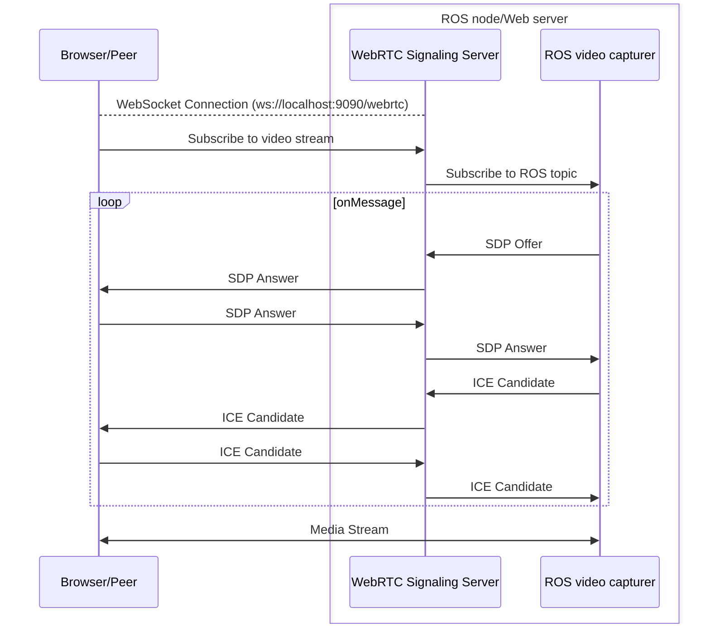

# WebRTC in js/browser

To use WebRTC in a browser, you need to use JavaScript. The following is a simple example of how to use WebRTC in a browser to create a peer connection and send a message.

## Example

You need to create a simple JS file with following steps:

1. Create a websocket connection (signaling channel):
    ```js
    const path = "ws://0.0.0.0:9090/webrtc"
    const signalingChannel = new WebSocket(path)
    ```
2. Create a peer connection:
    ```js
    const peerConnection = new RTCPeerConnection({
    	// iceServers: [{ urls: "stun:stun.l.google.com:19302" }], // Optional public STUN server
    	optional: [{ DtlsSrtpKeyAgreement: true }], // Optional DTLS key agreement
    })
    ```
3. Set the signaling channel to handle the messages (SDP offer, SDP answer, ICE candidate):

    ```js
    signalingChannel.onmessage = (e) => handleSignalingMessage(e, peerConnection, signalingChannel)

    function handleSignalingMessage(e, peerConnection, signalingChannel) {
    	const dataJson = JSON.parse(e.data)
    	if (dataJson.type === "offer") {
    		console.log("Received WebRTC offer")
    		peerConnection
    			.setRemoteDescription(new RTCSessionDescription(dataJson))
    			.then(() => sendAnswer(peerConnection, signalingChannel))
    	} else if (dataJson.type === "ice_candidate") {
    		console.log("Received WebRTC ICE candidate")
    		peerConnection.addIceCandidate(
    			new RTCIceCandidate({
    				sdpMLineIndex: dataJson.sdp_mline_index,
    				candidate: dataJson.candidate,
    			}),
    		)
    	}
    }
    ```

4. Set the peer connection to handle an ICE candidates:
    ```js
    peerConnection.onicecandidate = (event) => {
    	if (event.candidate) {
    		signalingChannel.send(
    			JSON.stringify({
    				sdp_mline_index: event.candidate.sdpMLineIndex,
    				sdp_mid: event.candidate.sdpMid,
    				candidate: event.candidate.candidate,
    				type: "ice_candidate",
    			}),
    		)
    	}
    }
    ```
5. Send the answer to the offer:

    ```js
    function sendAnswer(peerConnection, signalingChannel) {
    	peerConnection
    		.createAnswer()
    		.then((sessionDescription) => {
    			peerConnection.setLocalDescription(sessionDescription)
    			signalingChannel.send(JSON.stringify(sessionDescription))
    		})
    		.catch((error) => console.warn("Create answer error:", error))
    }
    ```

    > [!NOTE]
    > If you want to set the maximum bitrate, you must modify the SDP before sending the answer. You can do this by adding the following code to the `sendAnswer` function:
    >
    > ```js
    > const sendAnswer = (peerConnection, signalingChannel) => {
    > 	peerConnection
    > 		.createAnswer()
    > 		.then((sessionDescription) => {
    > 			// Limiting the bandwidth
    > 			const limit = "100" // 100 kbps
    > 			const arr = sessionDescription.sdp.split("\r\n")
    >
    > 			arr.forEach((line, index) => {
    > 				if (/^a=mid:(1|video)/.test(line)) {
    > 					// Detect the video m-line
    > 					arr.splice(index + 1, 0, "b=AS:" + limit)
    > 				}
    > 			})
    > 			const newSdp = new RTCSessionDescription({
    > 				type: sessionDescription.type,
    > 				sdp: arr.join("\r\n"),
    > 			})
    >
    > 			peerConnection.setLocalDescription(newSdp)
    > 			signalingChannel.send(JSON.stringify(newSdp))
    > 		})
    > 		.catch((error) => console.warn("Create answer error:", error))
    > }
    > ```

6. When you have a configured peer connection, add the video stream to the video element:
    ```js
    peerConnection.ontrack = (event) => {
    	console.log("Connecting WebRTC stream to <video> element", event.streams)
    	document.getElementById("videoElement").srcObject = event.streams[0]
    }
    ```
7. Subscribe to the video stream (configure message):

    ```js
    const topic = "/uav2/servo_camera/image_raw"
    const generateStreamId = () => "webrtc_ros-stream-" + Math.floor(Math.random() * 1000000000)

    function subscribeToVideo(peerConnection, signalingChannel) {
    	console.log("Requesting WebRTC video subscription")
    	const stream_id = generateStreamId()
    	const configMessage = {
    		type: "configure",
    		actions: [
    			{ type: "add_stream", id: stream_id },
    			{
    				type: "add_video_track",
    				stream_id: stream_id,
    				id: stream_id + "/subscribed_video",
    				src: "ros_image:" + topic,
    			},
    		],
    	}
    	signalingChannel.send(JSON.stringify(configMessage))
    	console.log("WebRTC ROS Configure: ", configMessage.actions)
    }
    ```

8. Connect to the signaling channel:
    ```js
    signalingChannel.onopen = () => {
    	console.log("WebRTC signaling connection established")
    	subscribeToVideo(peerConnection, signalingChannel) // Now we call this only when WebSocket is open
    }
    ```

## Workflow


